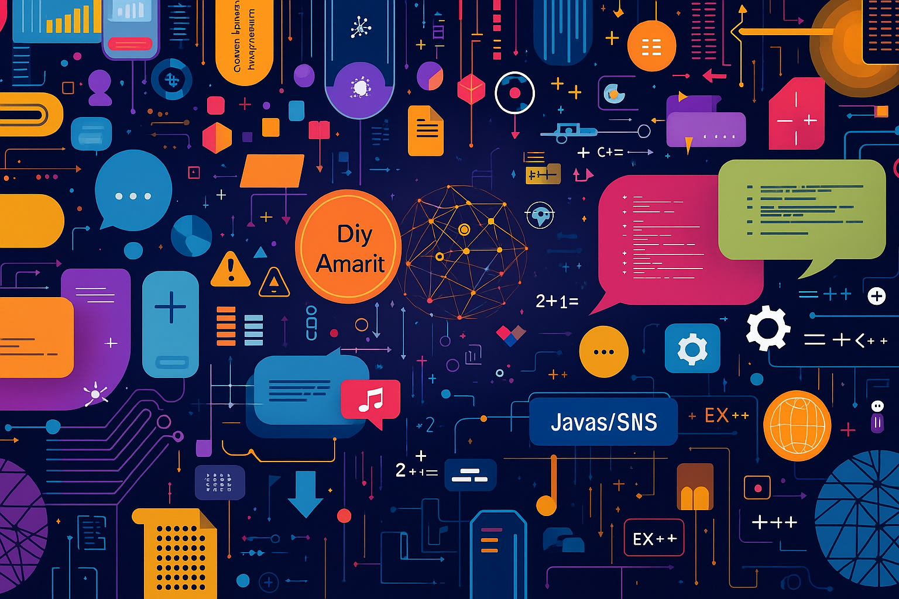

# Billion Count Benchmark

A simple project to measure and compare the time it takes for various programming languages to count to one billion (1,000,000,000).

## Results

Execution times were measured on a specific machine. **Your results will vary** based on your hardware (CPU, RAM) and software (OS, compiler/runtime version) environment.

| Language          | Time (seconds) | Compiler / Runtime Version |                  
| :---------------- | :------------: | :------------------------- |
| Python 3 | *47.741s* | Python 3.13.5 | 
| C++ | *0.889s* | clang++ 14.0.3 | 
| C | *0.739s* | clang++ 14.0.3 | 
| Ruby | *8.261s* | ruby 3.3.0 |
| Rust | *1.125s* | rustc 1.88.0 | 
| Julia | *0.290s* | |
| LLVM IR | *0.483s* | |
| OCaml | *1.267s* | |
| Perl | *16.218s* | |
| TeX | *6.355s* | |
| Typst | *2m46.676s* | |

These are example results. Please run the benchmarks on your own system to get accurate data.
